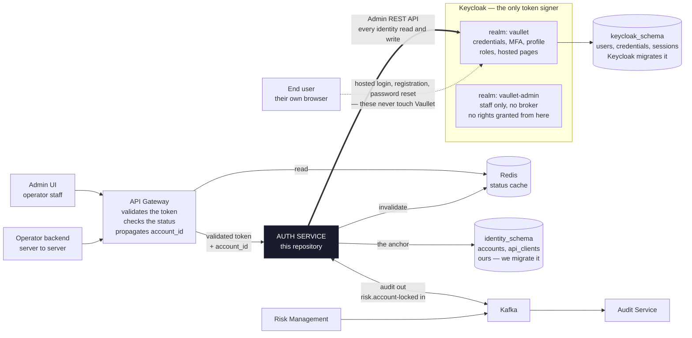
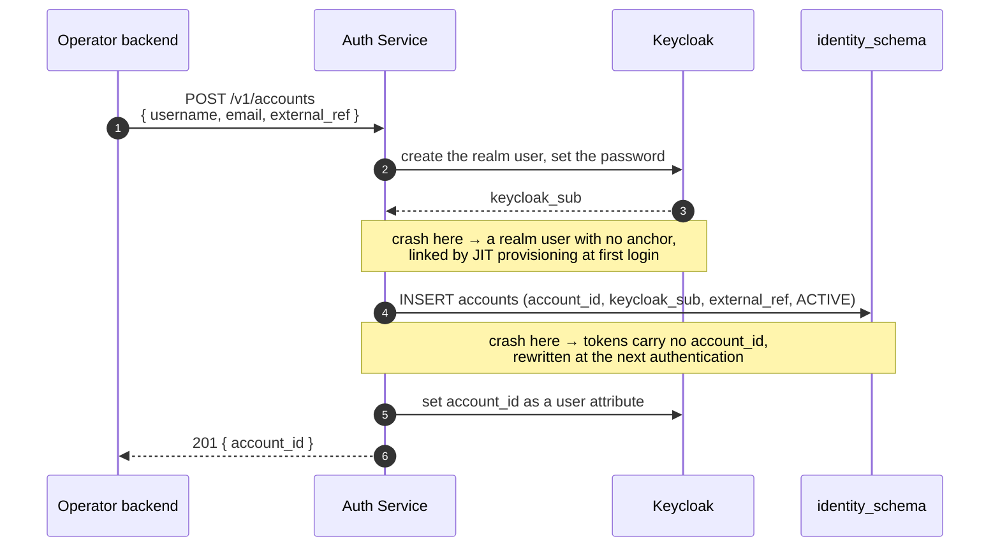
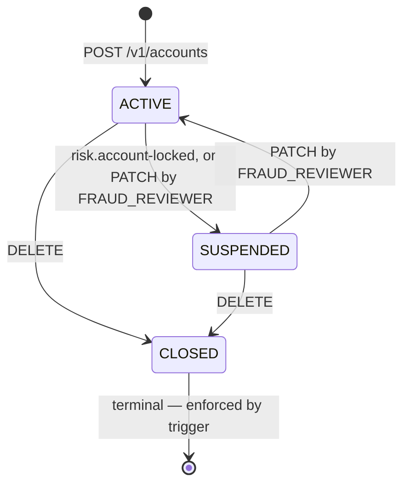
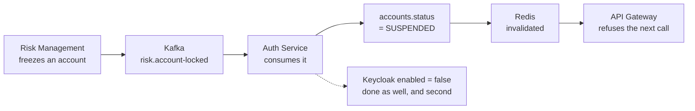

# wallet-auth-service

The account anchor and the identity adapter, per
[ADR-006](../architecture/docs/adr/006-authentication-and-identity.md) and
[ADR-014](../architecture/docs/adr/014-user-management-in-local-identity-mode.md).

This service owns **Vaullet's own record of a user** and brokers everything about that user's
*identity* to Keycloak without keeping a copy.

> ### Keycloak owns the identity. Vaullet owns the account.
>
> Two systems hold two different objects about the same person. Keycloak holds the person who logs
> in — credentials, MFA, email, name, roles. This service holds the thing money is keyed to: an
> `account_id`, a status, and a reference back. Neither is a copy of the other, so neither can go
> stale against the other, and **there is no reconciliation job anywhere in this design.**
>
> Almost every mistake available in this part of the system comes from treating them as one record
> stored twice.

> [!IMPORTANT]
> **Step 1 is implemented; steps 2–5 are not.** The account anchor — schema, repository, service and
> `/v1/accounts` — is written and tested, which completes *federated* identity mode. Keycloak
> integration, the identity facade and token exchange are not written, and nothing is deployed: the
> cluster has no PostgreSQL and no Keycloak. Read [Build order](#build-order) for what exists.

```
./mvnw spring-boot:run     # PostgreSQL via Compose, Flyway migrates, serves on :8080
./mvnw test                # 19 unit + architecture tests, no Docker          (~1s)
./mvnw verify              # adds 26 integration tests on real PostgreSQL     (~5s)
```

Then open <http://localhost:8080/swagger-ui.html>.

Resolving `dev.vaullet:common-*` needs a `github` server in `~/.m2/settings.xml` with a
`read:packages` token — GitHub Packages requires authentication even for a public artifact.

📐 **[Who Owns the User](https://vaullet-dev.github.io/wallet-auth-service/)** — the same material as
a page, with the full component map, a worked account creation, and every field's owner. See
[Rendering the diagrams](#rendering-the-diagrams) if that link 404s; Pages needs turning on once.

---

## Contents

- [What an account is](#what-an-account-is)
- [Who owns which fact](#who-owns-which-fact)
- [The two identity modes](#the-two-identity-modes)
- [The map](#the-map)
- [The API](#the-api)
- [The schema](#the-schema)
- [Creating an account](#creating-an-account)
- […and the ledger's account row](#and-the-ledgers-account-row)
- [The account status, and the freeze path](#the-account-status-and-the-freeze-path)
- [Security](#security)
- [Package structure](#package-structure)
- [Build order](#build-order)
- [Deliberate differences from the ledger](#deliberate-differences-from-the-ledger)
- [Releases](#releases)
- [Configuration and profiles](#configuration-and-profiles)
- [Decided, and what each one still needs](#decided-and-what-each-one-still-needs)
- [Rendering the diagrams](#rendering-the-diagrams)

---

## What an account is

There is no wallet service and no user table in the sense most people expect. A user's wallet is
spread across three owners, and each answers a different question:

| Owner | Question it answers | Where it lives |
| --- | --- | --- |
| **Account** — this service | Whose wallet is it, and may it be used right now? | `auth_db`, `identity_schema.accounts` |
| **Ledger** | What money is in it, and can it be spent? | `vaullet_db` ([ADR-004](../architecture/docs/adr/004-atomic-balance-reservations.md)) |
| **Transaction Service** | What did the user do with it? | `transactions_db` |

The account is the first of the three and the only one with no dependencies. Every other service
keys on the `account_id` it mints, across databases, by value — there is no foreign key between any
two of them.

### What the anchor holds, and what it deliberately does not

**Holds:** `account_id`, `keycloak_sub`, `external_ref`, `status`, timestamps. That is the complete
list, in **both** identity modes.

**Does not hold:** email, username, name, phone, date of birth, address, documents, password hashes,
MFA secrets, session state, role assignments. Those are Keycloak's, in its own schema in this same
database, and this service reads them over the Keycloak Admin REST API rather than keeping a copy.

A column added here is a copy of somebody else's record, and copies drift. That is the whole design
in one sentence, and the reason `docs/` exists is that it takes a page to make it obvious.

### Why the anchor exists at all

It is a narrow table and it is easy to argue it away — key everything on Keycloak's `sub` claim and
store nothing. ADR-006 rejected that, and it earns its keep three separate times:

1. **`ledger_entries` is immutable for seven years.** Keying immutable financial records on a
   mutable external identifier guarantees an unfixable migration later. A realm re-import, a change
   of identity provider, or an operator switching their upstream broker all change `sub`. None of
   them may move a balance.
2. **The fraud lock has to be enforceable against the operator's own directory.** If status lived
   upstream, a customer's IdP could overrule a freeze. See
   [the freeze path](#the-account-status-and-the-freeze-path).
3. **GDPR erasure and seven-year retention have to coexist.** Closing an account erases the Keycloak
   user and sets `status = 'CLOSED'`; every journal row stays valid, because it is keyed on an
   identifier that carries no personal data.

---

## Who owns which fact

One rule settles every field: **whoever owns a fact's failure mode owns the fact.** If getting it
wrong is an authentication problem, it is Keycloak's. If getting it wrong is a money problem, it is
ours.

| Fact | Owner | Why it lands there |
| --- | --- | --- |
| Password hashes, MFA enrolment, recovery codes, sessions, failed-login counters, password policy | **Keycloak** | ADR-006 *Alternative 4* decided not to write authentication. Never mirrored, never read, never in a Vaullet backup. |
| Username, email, name, phone, locale, email-verified | **Keycloak** | Registration data it already stores. A second copy buys a sync problem and nothing else. |
| Role assignment | **Keycloak assigns** | …but Vaullet enforces what a role *means*. Separation of duties is ledger and audit state, which no directory can express. |
| `account_id` | **this service** | Keys seven years of immutable journal. It must outlive Keycloak itself. |
| `status` — the freeze | **this service** | A fraud lock the operator's directory can overrule is not a fraud lock. |
| `external_ref` | **this service** | The operator's own user id. Promised unique and immutable to integrators, so it has to be a constraint. |
| Balances, holds, journal | **the ledger** | A different database and a different service, reached only by `account_id`. |

---

## The two identity modes

[ADR-006](../architecture/docs/adr/006-authentication-and-identity.md) sells to two operator shapes,
selected per deployment by `auth.provider` in the customer's Helm values. **User management is not
something an operator buys** — it arrives with `local` and is unavailable under `federated`, where
the operator's own directory does the job.

| | `auth.provider: local` | `auth.provider: federated` |
| --- | --- | --- |
| Who holds the user | Keycloak realm users. Vaullet is the identity provider. | The operator's OIDC or SAML provider, brokered into the same realm. |
| Registration | **Both paths, and an operator may use either or both.** Keycloak's hosted pages for self-service, `POST /v1/accounts` for operator-driven and bulk provisioning. | The operator's own signup. Nothing here is involved. |
| Password and MFA | Keycloak's, configured per realm as declarative YAML. | Upstream. Vaullet never sees a credential at all. |
| Identity sub-resources | Present. | `404 ENDPOINT_NOT_AVAILABLE`, and `/v1/capabilities` says so. |
| `keycloak_sub` at creation | Known immediately — the realm user is made first. | Null. Linked at first authentication. |
| The anchor | Identical — same columns, same constraints, same owner. | ← |
| The freeze | Identical, and authoritative in both. | ← |
| The token | Identical: same realm, same signing key, same claim set. **No other service can tell the modes apart**, which is the entire point of ADR-005's fourth category. | ← |
| PII in a Vaullet table | None. | None. |

---

## The map

Everything that touches a Vaullet user. **This repository is the single dark box.** Everything else
already exists in the cluster for other reasons.



Both schemas live in the one `auth_db`, and **no foreign key crosses between them** — a Keycloak
major upgrade migrates its own tables, and a reference from ours would make that upgrade our problem.

The heavy edge is the one [ADR-014](../architecture/docs/adr/014-user-management-in-local-identity-mode.md)
turns on: **every identity read and write is a live call to the Keycloak Admin REST API**, and
nothing is copied into a Vaullet table. The dashed edge is the end user talking to Keycloak
directly, which is the default — no password ever transits this service.

**Every other service in the platform is absent from this map on purpose.** They sit downstream of
the gateway, receive `account_id` in a validated token, and never call Auth Service at all.

### The facade, and what it costs

The alternative was a local read model of the Keycloak user, kept in sync by a Keycloak event
listener. ADR-014 rejected it and recorded the trigger for revisiting.

|  | Facade (**chosen**) | Local projection (deferred) |
| --- | --- | --- |
| Where a profile read is answered | Keycloak, live | A Vaullet table |
| Can go stale | Nothing to go stale | Yes — needs a rebuild job, a staleness alarm, an out-of-order guard |
| Admin search | Keycloak's search, intersected in the service | One SQL query, joined against `status` |
| PII at rest in Vaullet | None | The copy |
| Survives a Keycloak outage | No (reads fail) | Reads survive |

**The whole bill is admin search.** "Every `SUSPENDED` account with an `@acme.com` address" cannot be
one query, because the two halves live in different systems. Tracked as **R7** in
[`docs/adr/TODO.md`](../architecture/docs/adr/TODO.md) with a named trigger: an admin user list
slower than about a second, or an operator asking for exactly that filter. Because the *writes* are
identical under both designs, adding the projection later changes no API and breaks no integration.

---

## The API

[ADR-012](../architecture/docs/adr/012-external-api-surface.md)'s surface, versioned in the path per
[ADR-011](../architecture/docs/adr/011-api-versioning-and-openapi.md).

**Identity is a sub-resource of the account, not a parallel `/v1/users`.** Two nouns for one
identifier is how the *"Vaullet means both the platform and the ledger service"* problem started,
and a sub-resource puts the ownership boundary in the URL: the account is ours in every mode, the
identity only in local mode.

```
── implemented ─────────────────────────────────────────────────────────────
POST   /v1/accounts        {external_ref}  → 201 {account_id, status, external_ref, linked, …}
                                           | 400 VALIDATION_FAILED | 409 EXTERNAL_REF_TAKEN
                                           | 409 ACCOUNT_CLOSED
GET    /v1/accounts/{id}                   → 200 (same representation) | 404
GET    /v1/accounts/by-ref/{external_ref}  → 200 | 404
PATCH  /v1/accounts/{id}   {status}        → 200  ACTIVE | SUSPENDED | CLOSED
                                           | 409 ACCOUNT_CLOSED | 404

── step 4, local identity mode only ────────────────────────────────────────
GET    /v1/accounts/{id}/identity          → 200  from Keycloak, live
PATCH  /v1/accounts/{id}/identity          → 200  to Keycloak
POST   /v1/accounts/{id}/password-reset    → 202  Keycloak sends the mail
GET    /v1/accounts/{id}/roles             → 200  realm roles
PUT    /v1/accounts/{id}/roles             → 200
GET    /v1/accounts?email=&status=         → 200  Keycloak's search, intersected
DELETE /v1/accounts/{id}                   → 204  CLOSED here, erased there
```

Under `auth.provider: federated` the local-only endpoints return `404 ENDPOINT_NOT_AVAILABLE`, and
`GET /v1/capabilities` reports `user_management: false` — the mechanism ADR-012 §4 already defines
for module-gated resources, reused for a mode-gated one.

**`POST /v1/accounts` takes one field, `external_ref`**, and needs no `Idempotency-Key` because of
it. It deliberately accepts no `keycloak_sub`: no HTTP caller is in a position to know one — in local
mode this service mints the realm user itself (step 4), and in federated mode just-in-time
provisioning supplies it (step 2). The column is nullable for that listener, not for the API.

**The response omits the Keycloak subject too**, reporting `linked: true|false` instead. ADR-006's
central property is that downstream keys on `account_id` and never on `sub`; handing the subject to an
operator invites exactly the coupling the anchor exists to prevent. Creating an account writes to Keycloak *and* to this database with
no transaction spanning the two, so the retry path **is** the recovery path — but the account's own
natural keys make a retry recognisable without a separate one. See
[Idempotency without an idempotency key](#idempotency-without-an-idempotency-key) for why this is the
one endpoint entitled to skip the platform rule.

Wire conventions, all from ADR-011 §7–8:

| | |
| --- | --- |
| Keys | `snake_case` |
| Timestamps | RFC 3339 UTC |
| Errors | RFC 9457 `problem+json` with a stable `code` and a `trace_id` |

```json
{
  "type": "https://docs.vaullet.dev/errors/external-ref-taken",
  "title": "External reference already in use",
  "status": 409,
  "detail": "External reference 'acme-user-8813' is already in use",
  "instance": "/v1/accounts",
  "code": "EXTERNAL_REF_TAKEN",
  "trace_id": "68f0a1…"
}
```

**`code` is the contract; `detail` is for humans.** Branch on `code`, never on the prose.

### This service's error codes

Three, alongside the platform codes in `CommonErrorType`. Each exists because `RESOURCE_CONFLICT`
would have been technically correct and practically useless: an integrator that gets a 409 from
`POST /v1/accounts` has three different problems to tell apart, and each has a different fix.

| Code | Status | Raised when |
| --- | --- | --- |
| `EXTERNAL_REF_TAKEN` | 409 | Another account carries this `external_ref` **and a different `keycloak_sub`** — two identities claiming one operator id. A repeat with no contradiction is a retry, not this. |
| `IDENTITY_ALREADY_LINKED` | 409 | Another account is already linked to this `keycloak_sub`. Guards the failure ADR-006 names: a subject collision after an IdP migration, producing two accounts for one person and splitting their balance. |
| `ACCOUNT_CLOSED` | 409 | The account is `CLOSED`, and closure is terminal. A 409 rather than a 404 — the account exists and the caller is entitled to know it exists. |

Neither `IDENTITY_ALREADY_LINKED`'s message nor `EXTERNAL_REF_TAKEN`'s names the *other* account. A
caller holding one identifier should not learn another from an error body; that is a cross-system
lookup nobody granted them.

---

## The schema

`identity_schema` in `auth_db`, alongside `keycloak_schema`
([ADR-003](../architecture/docs/adr/003-hybrid-database-strategy-with-analytics.md)). **No foreign
key crosses between them.** `keycloak_sub` is a plain `UUID` on purpose: a Keycloak major upgrade
migrates its own tables, and a reference from here would make that upgrade our problem.

**[`docs/schema/`](docs/schema/) is the authoritative description**, generated from a real database:
a throwaway PostgreSQL migrated by Flyway, then the page written from `pg_catalog`. It therefore
shows what the database *ended up with* — the indexes `UNIQUE` created, the form PostgreSQL rewrote
each `CHECK` into, the trigger timing — rather than what the DDL appears to say. The migration itself
is [`V1__identity.sql`](src/main/resources/db/migration/V1__identity.sql).

```sql
CREATE TABLE accounts (
    account_id   UUID        NOT NULL,
    keycloak_sub UUID        NULL,        -- null = unlinked anchor; set at first authentication
    external_ref TEXT        NULL,        -- operator's own user id; immutable once set
    status       TEXT        NOT NULL,
    created_at   TIMESTAMPTZ NOT NULL DEFAULT now(),
    updated_at   TIMESTAMPTZ NOT NULL DEFAULT now(),

    CONSTRAINT accounts_pk              PRIMARY KEY (account_id),
    CONSTRAINT accounts_keycloak_sub_uk UNIQUE (keycloak_sub),
    CONSTRAINT accounts_external_ref_uk UNIQUE (external_ref),
    CONSTRAINT accounts_status_ck       CHECK (status IN ('ACTIVE','SUSPENDED','CLOSED')),

    -- Every account must be addressable by something other than the id we just minted.
    -- This is what makes creation retry-safe without an idempotency column — see below.
    CONSTRAINT accounts_natural_key_ck
        CHECK (external_ref IS NOT NULL OR keycloak_sub IS NOT NULL),

    -- An empty string is not a missing value. Allowing both gives two spellings of "no operator
    -- reference", one of which silently defeats the constraint above.
    CONSTRAINT accounts_external_ref_not_blank_ck
        CHECK (external_ref IS NULL OR length(btrim(external_ref)) > 0)
);
```

ADR-014 §5, plus two `CHECK`s. **There is no idempotency column**: the natural keys already carry it.

Every column, and why:

| Column | Why it is here |
| --- | --- |
| `account_id` | ADR-004. Keys seven years of immutable journal, so it must outlive Keycloak. |
| `keycloak_sub` | ADR-014, closing **B2**. **Nullable**, and that is not a hole — it is the *unlinked anchor*, an account the operator provisioned for someone who has not authenticated yet. Every reader has to handle it; the ledger never sees it, because it keys on `account_id`. Updatable, unlike `external_ref`: ADR-006 allows a deliberate re-point when an operator migrates IdP. |
| `external_ref` | ADR-012, closing **B3**. Unique and immutable *were* promises with no column to keep them; below they are constraints. |
| `status` | ADR-006. `ACTIVE \| SUSPENDED \| CLOSED`. ADR-006 originally wrote `LOCKED`; ADR-014 renamed it, because ADR-012 had already published `SUSPENDED` to operators **and** because Keycloak uses "locked" for a user its own brute-force detection locked out — a different thing entirely, in the same deployment. |

`UNIQUE` on two nullable columns is deliberate and load-bearing: PostgreSQL treats NULLs as
*distinct*, so any number of accounts may be unlinked or unnamed, while no two may claim the same
identity or the same reference. `NULLS NOT DISTINCT` would break the unlinked anchor on the second
row.

### Idempotency without an idempotency key

`POST /v1/accounts` is retry-safe, and it gets there without the `Idempotency-Key` header that
ADR-011 makes a platform rule for state-changing POSTs. **This is a deliberate deviation, and it is
the only endpoint on the platform entitled to it**, because the resource has natural keys that a
reservation does not: `external_ref` and `keycloak_sub` are both unique, both immutable in practice,
and at least one is always present. A retry is therefore *recognisable from the request itself*.

An account is created for a person who already exists in some other system — the operator's user
table, or the Keycloak realm — so the caller always holds an identifier for them before they hold
ours. A hold has no such prior identity, which is why the ledger needs a key and this does not.

The three cases, resolved entirely from the natural keys:

| Second request arrives with | Meaning | Answer |
| --- | --- | --- |
| The same `external_ref` (or the same `keycloak_sub`), nothing else contradicting | A retry. The operator's user id names the same person it named a moment ago. | `201` with the **existing** account — never a second one |
| The same `external_ref`, a **different** `keycloak_sub` | Two identities claiming one operator id | `409 EXTERNAL_REF_TAKEN` |
| The same `keycloak_sub`, a **different** `external_ref` | One identity claiming two operator ids — ADR-006's subject collision | `409 IDENTITY_ALREADY_LINKED` |

`201` on a replay rather than `200`, matching the ledger: the alternative makes a caller's retry path
behave differently from its first attempt, which is the opposite of what retry-safety is for.

An `Idempotency-Key` header is accepted and logged when sent, so an integrator that puts one on every
POST is not punished for it. It is not stored and not required.

The `CHECK` is what makes all of this hold. Without it an account could be created with neither key,
and *that* request — the one addressable only by the id in its own response — would be the single
un-retryable call in the API.

### Two invariants the database owns

A `BEFORE UPDATE` trigger, not a `RULE`. A rule with `DO INSTEAD NOTHING` makes a forbidden write
*succeed silently*, which is a worse failure than the one it prevents — the ledger has two of those
and they are a wart. These raise `check_violation` (SQLSTATE 23514), so the caller gets a refusal
rather than a lie.

1. **`external_ref` is immutable once set.** ADR-012 tells operators it never changes under them.
   Unless that is a constraint, it is a hope.
2. **A closed account does not reopen.** Closure is an erasure event with an audit trail behind it;
   reviving the row would leave that trail describing something no longer true. A returning user
   gets a new `account_id`.

The service raises `ACCOUNT_CLOSED` *before* the write, so the trigger is a backstop and not the
normal path. Both refuse; only one explains.

---

## Creating an account

Every other operation here is a single call to a single system. Creating a user is **three writes
across two systems with no transaction spanning them**, so it is the one place the split costs
something.



**The answer is not a distributed transaction.** Every step is idempotent, and the repair path
already had to exist: just-in-time provisioning is the only way a *federated* user ever gets an
anchor, so the local-mode create path inherits crash recovery for free. Getting a second use out of
machinery you were already forced to build is usually the sign a boundary is in the right place.

| Fails after | Leaves | Repaired by |
| --- | --- | --- |
| The realm user is created | A Keycloak user with no anchor | JIT provisioning at first login |
| The anchor is inserted | An account whose tokens carry no `account_id` | The attribute write is re-attempted at next authentication |
| Nothing | Nothing | The caller retries; the natural key resolves it to the same account |

### One endpoint, two modes — and why that closes B2

`POST /v1/accounts` means *"make me an account"* in both modes. What differs is how much identity
exists at the time.

- **Local:** create the Keycloak user, then the anchor. `keycloak_sub` is known at insert time.
- **Federated:** insert the anchor alone, `keycloak_sub` null, linked at first authentication.

As ADR-006 and ADR-012 stood, these contradicted each other: JIT provisioning required
`keycloak_sub NOT NULL` while the operator was offered `POST /v1/accounts` for a user who has never
logged in. **The insert failed on the first call of every integration.** Making the column nullable
turns that from a bug into a named state.

### What a replay must check

A retry is resolved against the natural key **and verified against the rest of the request** — see
[Idempotency without an idempotency key](#idempotency-without-an-idempotency-key). A request that
matches on one key and contradicts on the other is a caller bug, not a replay, and it gets a conflict
rather than somebody else's account. The ledger does not check its replays this way on the reserve
path; this service should not copy that.

### …and the ledger's account row

**Creating an account here must create the ledger's row too.** Nothing in the architecture currently
does this: `account_balances` has no creator, and the ledger has no create endpoint — the gap the
money-model review surfaced as *"no document says who creates the ledger's account row or its cash
bucket"*.

Three ways to close it, and the right answer is a combination of two:

| | How | Why not alone |
| --- | --- | --- |
| **A. Synchronous call** | Auth Service calls the ledger before returning `201` | Account creation then fails when the ledger is down, and the write now spans *three* systems with no transaction. It also inverts the dependency: the ledger is the platform's most protected service and should not accept writes from an identity adapter. |
| **B. Event** | Auth publishes `identity.account-created.v1`; the ledger consumes it and inserts the row | Eventually consistent, so a deposit can arrive before the row exists |
| **C. Lazy** | The ledger creates the row on the first credit that touches the account | Satisfies nothing until money moves — and you asked for the row to exist when the account does |

**Do B, and make the ledger's consumer an idempotent upsert on `account_id`.** C then falls out for
free: any credit path upserts the same way, so if money somehow arrives before the event, the row is
created by whichever gets there first and the other becomes a no-op. The window B introduces is
closed by the property that makes B safe to retry in the first place.

The upsert creates `account_balances` **and** the singleton `CASH` bucket, since an account with no
cash bucket cannot be credited and the ledger's own schema says there is exactly one per account.

> [!NOTE]
> **There is no outbox anywhere in this architecture.** Publishing after the commit means a crash
> between the two loses the event permanently. Here that is survivable precisely because of the
> upsert — the first deposit repairs it — but it is survivable by accident rather than by design, and
> it is the same gap every other event producer on the platform will hit. Worth a decision of its own
> before the second producer exists.

This lands at step 2, when this service first has a Kafka producer. Until then step 1 mints
`account_id` and nothing downstream consumes it, which is fine: there is no ledger deployment to be
inconsistent with.

---

## The account status, and the freeze path



The freeze is the one sequence that explains the whole design. It runs identically in both modes, it
never asks the operator's directory for permission, and it is the reason `status` cannot live in
Keycloak.



**Keycloak's `enabled` flag is not the primary control**, and this is worth being explicit about
because it is the obvious-looking shortcut. Disabling a Keycloak user stops *new* logins but does
not invalidate a token already issued — a frozen user would keep transacting for up to the token
lifetime, fifteen minutes. It would also require Risk Management to hold write credentials against
the directory, giving a sellable module administrative authority over it. And under brokering, the
upstream IdP re-asserts the user at next login.

So **Vaullet will refuse a user the operator's own identity provider still considers perfectly
fine.** That asymmetry is deliberate, it has to be in the contract and in the operator's runbook, and
it only works because the authoritative status sits in a table we own.

---

## Security

This service validates tokens exactly like every other service does. **Keycloak is the only signer
in the platform** (ADR-006); this service brokers and never mints. If it ever needed its own token
handling, something would have gone wrong.

Scopes, for [ADR-008](../architecture/docs/adr/008-service-to-service-authentication.md)'s Layer 3
table — which does not yet have these rows:

| Scope | Covers |
| --- | --- |
| `identity:read` | `GET /v1/accounts/**` |
| `identity:admin` | `POST`, `PATCH`, `PUT`, `DELETE` |

Roles are realm roles from `realm_access.roles`, mapped to `ROLE_*` by `backend-common`'s
`JwtAuthorityMapper`. **Keycloak assigns them; this service enforces what they mean.**

| Endpoint | Role |
| --- | --- |
| `POST /v1/accounts`, the identity sub-resources, `DELETE` | `SUPER_ADMIN` |
| `PATCH /v1/accounts/{id}` — the freeze | `FRAUD_REVIEWER` |
| `GET` anything | `SUPPORT_AGENT` and up |

**The freeze deliberately sits on a different endpoint from user administration.** Two endpoints,
two roles, two audit streams — ADR-006's separation of duties comes out of the resource layout
rather than being enforced on top of it. Keep it that way: folding the status change into
`PATCH …/identity` would quietly hand user administrators the ability to un-freeze a fraud case.

`@PreAuthorize` goes on the **service** methods, not the controllers. The ledger puts them on
controllers and its own code says they belong a layer down; this service has no such history, and
step 2 adds a Kafka listener that must be governed by the same rules without a second copy of them.

---

## Build order

ADR-014's order, because each step is independently useful and the first one unblocks other repos.

| # | Step | What it delivers | State |
| --- | --- | --- | --- |
| 1 | **The anchor** — migration, DAO, service, `POST`/`GET /v1/accounts`, `by-ref`, `PATCH` status | **Federated mode is complete here.** 25 main sources, 45 tests | ✅ **done** 2026-09-17 |
| 2 | Token validation, the `account_id` protocol mapper, JIT provisioning, and the `identity.account-created.v1` producer | Tokens carry `account_id`; the unlinked anchor gets linked; the ledger gains its `account_balances` row | ⬜ **next** |
| 3 | Status enforcement and the Redis-cached gateway check | The freeze takes effect | ⬜ |
| 4 | The Keycloak admin client and the identity sub-resources | Local mode's user management — the facade | ⬜ |
| 5 | `api_clients` and token exchange (RFC 8693) | Operator server-to-server integration | ⬜ |

Nothing else in the platform depends on steps 4 or 5, which is why they are last despite being the
part this service is named after.

### Deliberately not now

- **A local read projection.** Rejected as ADR-014's *Alternative 1*, with the trigger recorded as
  **R7**. Additive later; costs nothing to defer.
- **Bulk import.** A local-mode operator migrating from an existing system needs it and will drive a
  per-user REST loop until it is designed.
- **End users editing their own profile.** That is Keycloak's account console, not our API.

---

## Package structure

```
dev.vaullet.auth
├── AuthApplication.java              entry point: @SpringBootApplication and nothing else
├── package-info.java                 @NullMarked
│
├── common/error/                     this service's share of the error vocabulary
│   ├── AuthErrorType.java            EXTERNAL_REF_TAKEN, IDENTITY_ALREADY_LINKED, ACCOUNT_CLOSED
│   ├── AuthApiExceptionHandler.java  the shared advice, plus one DuplicateKeyException backstop
│   └── exception/                    the concrete throwables
│
└── account/                          ← the feature slice
    ├── api/v1/                       controller + dto/ — versioned, because ADR-011 §4 runs v1 and
    │                                 v2 side by side for twelve months
    ├── service/                      AccountService, Account, AccountStatus, NewAccount,
    │                                 validation/ — rules, transactions, authorisation
    └── dao/                          AccountRepository + AccountStatements — every statement
```

**The SQL is not in the Java.** `db/sql/accounts/*.sql` holds the five statements, loaded eagerly at
startup by `AccountStatements` so a renamed file fails the context rather than an endpoint. The
reasoning for each one lives in the file with it, which is also where it is useful: SQL comments reach
the server, so a statement misbehaving in `pg_stat_activity` names its own source file.

**Only the API layer is versioned.** ADR-011 versions the wire, not the domain, and the separate DTO
types are what let the two move independently. A `/v2` needing its own `AccountService` would mean the
version boundary was drawn in the wrong place.

**Every package carries its own `package-info.java`** with `@NullMarked`. Java packages do not nest
for annotation purposes — `spring-core` ships fifty of these files for the same reason — so the
declaration at the root reaches only `AuthApplication`.

**No records.** Classes throughout: `AccountRow`, `Account`, `NewAccount` and the DTOs. `Account`'s
`equals` is identity-only — the same account with a changed status is still the same account — which
value-equality across all six fields would have got wrong.

---

## Deliberate differences from the ledger

Same template, same platform library, same three layers (`api` → `service` → `dao`) enforced by
ArchUnit. Where this service departs, it is on purpose, and mostly because the ledger has already
demonstrated the cost.

**1. The status guard lives in the `WHERE` clause, never in a preceding read.**

```sql
UPDATE accounts SET status = ?, updated_at = now()
 WHERE account_id = ? AND status <> 'CLOSED'
RETURNING …
```

The ledger's `release()` reads the state, decides, then writes — which leaves a window in which
another request changes the row between the two, and the update proceeds on a state that no longer
exists. Here the condition and the write are one statement, so the database evaluates the guard
against the row it is about to modify. `RETURNING` makes the outcome unambiguous without a second
read: a row means the transition happened, empty means the guard refused.

Deciding *which* refusal it was — no such account, or a closed one — is then safe with a follow-up
read, **and only because `CLOSED` is terminal**. Both outcomes are permanent, so the answer cannot
change under the reader. A guard on a state that could be left again would need the row locked
instead.

**2. Flyway gets its own datasource, and in a deployed environment its own role.** The ledger's `1s`
`statement_timeout` is set on the shared Hikari pool, so it also applies to migrations — a long
`ALTER` on a large table is not a runaway query, but it would be killed like one. Here
`spring.flyway.url/user/password` are separate, which also makes "the app role cannot drop a table"
true rather than aspirational (the 2026-09-14 decision: a migrator role and an app role per service).

**3. No error bridge.** The ledger carries `LedgerErrorBridge`, documented in its own Javadoc as
scaffolding meant to be deleted, because its service predates the `common/error` layer. This service
throws `ApplicationException` subclasses from the start, so the library's single handler covers
everything and there is no advice-ordering puzzle.

**4. No `latest` image tag.** ADR-010 §4 says a GitOps manifest must never reference a mutable tag.
The simplest way to keep that true is not to publish one.

**5. `RESOURCE_BUSY`, not a renamed local code.** The ledger overrides `lockContentionErrorType()`
because `ACCOUNT_BUSY` was published before `RESOURCE_BUSY` existed. This service has no such
history, so it inherits the platform code and a reader has one less local exception to learn.

---

## Releases

There is **no version number committed anywhere** in this repository, and `master` never carries a
`-SNAPSHOT`. Both follow from one decision: a version is a statement about what changed, and the only
record of what changed is the commit log. Deriving the number from the log means it cannot disagree
with the code, and there is no "bump the version" commit to forget or to conflict.

[semantic-release](https://semantic-release.gitbook.io) does the deriving, on every push to `master`:

| | |
| --- | --- |
| `feat:` · `feature:` | MINOR — something new, everything that worked still works |
| `fix:` · `patch:` · `perf:` · `refactor:` · `deps:` | PATCH |
| `feat!:` · `breaking:` · a `BREAKING CHANGE:` footer | MAJOR |
| `chore:` · `docs:` · `test:` · `ci:` · `style:` | no release |

One run does all of it: computes the number, builds and pushes `ghcr.io/vaullet-dev/auth-service:X.Y.Z`,
writes `CHANGELOG.md`, commits it, tags `vX.Y.Z`, and publishes the release notes. A push carrying
only `chore`/`docs`/`test` commits exits cleanly having done nothing, which is correct rather than a
failure.

**The image is pushed in `prepare`, before the tag is written.** semantic-release tags between
`prepare` and `publish`, so pushing from a publish step would tag a commit whose image may not exist —
and the next run would compute the following version from that tag, silently skipping the gap. The
ledger's hand-written workflow argues for this ordering in a comment and achieves it by putting the
tag step last; here it falls out of where the plugin sits.

**This replaces `scripts/version.sh`**, which the ledger and `backend-common` still use. That script
answers "what number is this build" correctly but never creates the tag, writes a changelog entry or
publishes notes — which is why `backend-common`'s CHANGELOG still files everything under
*Unreleased* while 0.1.0 and 0.1.1 sit in GHCR. This repository is where the replacement is being
proved before the other two migrate.

Locally: `npm ci` then `npm run release:dry`. It needs push credentials even in dry-run, so it only
runs properly in CI; `npx commitlint --from HEAD~1` checks a message without any credentials at all.

---

## Configuration and profiles

| Profile | Activated by | What it changes |
| --- | --- | --- |
| *(none)* | a deployed `java -jar` | Secure by default. No `OAUTH2_ISSUER_URI` means no `JwtDecoder`, which means **the context refuses to start** rather than starting without token validation. |
| `local` | `./mvnw spring-boot:run` | Compose-managed PostgreSQL, SQL logging, all actuators, 100% trace sampling, and the real authorisation rules granted to the anonymous principal. |
| `prod` | the deployment | ECS structured logging, health details only when authorised, Compose off. |
| `test` | `@IntegrationTest` | Testcontainers owns the database; Flyway still runs, so a broken migration fails the build rather than the deploy. |

Under `local`, `vaullet.security.local.anonymous-authorities` grants **both**
`ROLE_SUPER_ADMIN` and `ROLE_FRAUD_REVIEWER`. That is a deliberate convenience with a deliberate
cost: a developer exercises the real `@PreAuthorize` rules, but the *separation* between the two
roles is not observable by hand. `AccountApiIT` has to assert it with distinct principals — the
local profile cannot.

Credentials come from OpenBao through External Secrets
([gitops](../gitops)). Nothing in this repository holds one.

---

## Decided, and what each one still needs

The five questions this README opened were answered on 2026-09-16. Four are closed; each leaves a
small edit somewhere else.

| | Decision | Still to do |
| --- | --- | --- |
| **Registration** | **Both.** Keycloak's hosted pages for self-service *and* `POST /v1/accounts` for operator-driven and bulk provisioning. An operator may use either, or both at once. | ADR-014 leaves this open and should record it. `auth.userManagement.selfRegistration` becomes a two-value setting rather than a choice between paths. |
| **Schema name** | **`identity_schema`**, matching ADR-003 and every diagram. | ADR-006 *Database placement* says "a separate `identity` schema" — a one-word edit, and it has to happen **before the first migration runs**, because after that it is a rename. |
| **`idempotency_key` column** | **No.** The natural keys carry it — see [Idempotency without an idempotency key](#idempotency-without-an-idempotency-key). | ADR-011 makes `Idempotency-Key` a platform rule; this endpoint's exemption needs one paragraph in ADR-014 saying why, or the next reviewer will read it as an oversight. |
| **The ledger's account row** | **Created whenever an account is created**, by event plus idempotent upsert — see [above](#and-the-ledgers-account-row). | A new ADR-007 topic, a consumer and an upsert in the ledger, and a decision on the missing outbox. The largest item on this list by some distance. |

### Still open

**ADR-008 has no rows for `identity:read` / `identity:admin`.** This is not paperwork. ADR-008's
scope table is the *source* the mesh policy and the Keycloak client scopes are generated from, so an
endpoint missing from it is not merely undocumented — it is ungoverned in one direction and
unreachable in the other:

- **Unreachable:** no Keycloak client is configured to request `identity:admin`, so no real token
  ever carries it, and `@PreAuthorize("hasAuthority('SCOPE_identity:admin')")` refuses *everyone*.
  The Admin UI's first call to `POST /v1/accounts` gets a 403 that looks like a bug in this service.
- **Ungoverned:** whatever the mesh policy is generated from does not know these endpoints exist, so
  the network rule that should limit who can reach them is absent.

None of it bites during **step 1**, which runs under the `local` profile where the anonymous
principal is handed both scopes directly. It bites the moment a real token appears, in step 2. Two
rows, and the same class of omission as **B4** — worth fixing in one pass with it.

---

---

## Rendering the diagrams

**GitHub does not render HTML files in the repository view** — it shows sanitised source, and
`<style>` and `<script>` are stripped regardless. So the page in `docs/` reaches a reader two ways:

**1. Mermaid, inline in this README.** GitHub renders ```` ```mermaid ```` fences natively, themed
to the reader's light or dark mode, with no setup at all. That is what the three diagrams above are.
They are the same content as the page, laid out by Mermaid rather than by hand.

**2. GitHub Pages, for the full version.** `docs/index.html` is the standalone page — the complete
component map, the every-field ownership table, and the worked account creation, in the
[vaullet.dev](https://vaullet.dev) design language. To publish it:

> **Settings → Pages → Source: Deploy from a branch → Branch: `main`, folder: `/docs` → Save.**

It then serves, byte for byte as designed, at
**<https://vaullet-dev.github.io/wallet-auth-service/>** — the link at the top of this README. First
publish takes a minute or two. `docs/.nojekyll` is there so Pages serves the file as-is instead of
running it through Jekyll.

Editing it means editing the HTML by hand, or asking for a republish of the artifact it came from
and re-exporting. It is a document, not a template — treat it as something to redraw rather than
maintain.

---

## Documents

| | |
| --- | --- |
| [ADR-006](../architecture/docs/adr/006-authentication-and-identity.md) | Authentication and identity — the two modes, Keycloak, the anchor |
| [ADR-014](../architecture/docs/adr/014-user-management-in-local-identity-mode.md) | User management — the facade, the amended anchor, the resource shape |
| [ADR-003](../architecture/docs/adr/003-hybrid-database-strategy-with-analytics.md) | `auth_db` and the schema split |
| [ADR-005](../architecture/docs/adr/005-module-composition-and-deployment-topology.md) | Why this is a Category 4 capability and not a sellable module |
| [ADR-008](../architecture/docs/adr/008-service-to-service-authentication.md) | Scopes |
| [ADR-011](../architecture/docs/adr/011-api-versioning-and-openapi.md) · [ADR-012](../architecture/docs/adr/012-external-api-surface.md) | Wire conventions and the published surface |
| [ADR-013](../architecture/docs/adr/013-backend-common-shared-library.md) | What `backend-common` provides and why it is not in this repository |
| [`docs/adr/TODO.md`](../architecture/docs/adr/TODO.md) | The open-items register — **B4**, **R7** and the rest |
