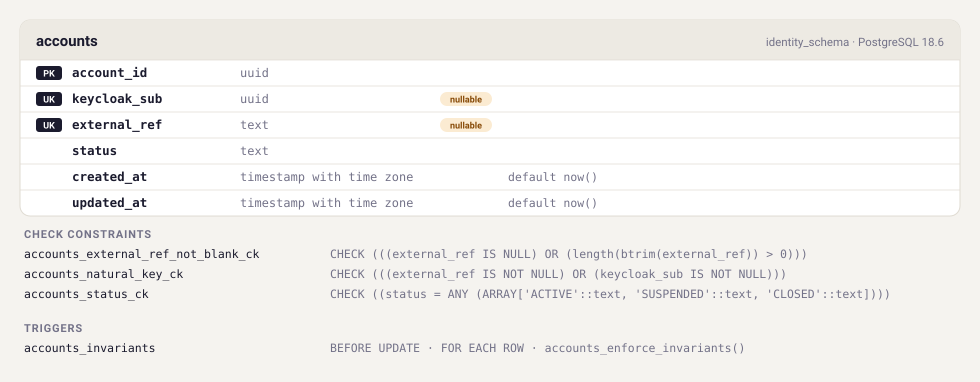

# `identity_schema` — generated schema

> **Generated from a real database.** A throwaway PostgreSQL is migrated by Flyway from
> `src/main/resources/db/migration/`, then this page is written from `pg_catalog`. It therefore
> describes what the database *ended up with*, not what the DDL appears to say — including the
> indexes a `UNIQUE` constraint created, the system names that show up in error messages, and
> the trigger timing. Do not edit by hand.

PostgreSQL **18.6** · Flyway **12.4.0**

| Migration | Description | Checksum |
| --- | --- | --- |
| `V1` | identity | `-413149361` |

## `accounts`

Vaullet's own record of a user: the identifier money is keyed to, and its status. Holds no personal data in either identity mode (ADR-006, ADR-014).

| | Column | Type | Null | Default |
| --- | --- | --- | --- | --- |
| `PK` | `account_id` | `uuid` | — |  |
| `UK` | `keycloak_sub` | `uuid` | **nullable** |  |
| `UK` | `external_ref` | `text` | **nullable** |  |
|  | `status` | `text` | — |  |
|  | `created_at` | `timestamp with time zone` | — | `now()` |
|  | `updated_at` | `timestamp with time zone` | — | `now()` |

### What each column is for

- **`account_id`** — Permanent. Keys seven years of immutable ledger journal, so it must outlive Keycloak, a realm re-import, or a change of identity provider.
- **`keycloak_sub`** — Keycloak user id. NULL = unlinked anchor: provisioned before the user ever authenticated. Set by just-in-time provisioning at first login.
- **`external_ref`** — The operator's own user id. Unique per deployment and immutable once set (ADR-012); immutability is enforced by the accounts_invariants trigger.
- **`status`** — ACTIVE | SUSPENDED | CLOSED. Authoritative here, not in Keycloak: a fraud lock the operator's directory could overrule is not a fraud lock. CLOSED is terminal.

### Constraints

| Name | Kind | Definition |
| --- | --- | --- |
| `accounts_external_ref_not_blank_ck` | CHECK | `CHECK (((external_ref IS NULL) OR (length(btrim(external_ref)) > 0)))` |
| `accounts_natural_key_ck` | CHECK | `CHECK (((external_ref IS NOT NULL) OR (keycloak_sub IS NOT NULL)))` |
| `accounts_status_ck` | CHECK | `CHECK ((status = ANY (ARRAY['ACTIVE'::text, 'SUSPENDED'::text, 'CLOSED'::text])))` |
| `accounts_pk` | PRIMARY KEY | `PRIMARY KEY (account_id)` |
| `accounts_external_ref_uk` | UNIQUE | `UNIQUE (external_ref)` |
| `accounts_keycloak_sub_uk` | UNIQUE | `UNIQUE (keycloak_sub)` |

### Indexes

| Name | Definition |
| --- | --- |
| `accounts_external_ref_uk` | `CREATE UNIQUE INDEX accounts_external_ref_uk ON identity_schema.accounts USING btree (external_ref)` |
| `accounts_keycloak_sub_uk` | `CREATE UNIQUE INDEX accounts_keycloak_sub_uk ON identity_schema.accounts USING btree (keycloak_sub)` |
| `accounts_pk` | `CREATE UNIQUE INDEX accounts_pk ON identity_schema.accounts USING btree (account_id)` |

### Triggers

- **`accounts_invariants`** — `CREATE TRIGGER accounts_invariants BEFORE UPDATE ON identity_schema.accounts FOR EACH ROW EXECUTE FUNCTION identity_schema.accounts_enforce_invariants()`

## Diagram

<picture>
  <source media="(prefers-color-scheme: dark)" srcset="erd-dark.svg">
  
</picture>

## Other objects

| Kind | Name |
| --- | --- |
| function (plpgsql) | `accounts_enforce_invariants` |
| table (Flyway-owned) | `flyway_schema_history` |

Full DDL as the database reports it: [`schema.sql`](schema.sql). Machine-readable catalog: [`schema.json`](schema.json).
